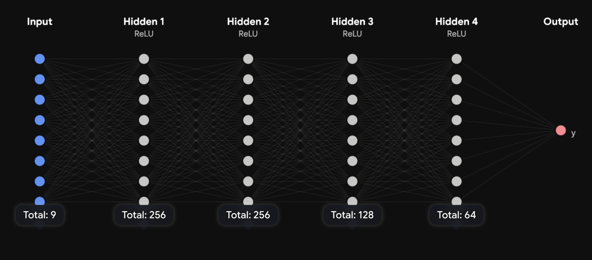

# The acrhitecture of the neural network of the model

The model has 9 input features:
- sin(time)
- cos(time)
- latitude
- longitude
- direction
- vehicle (splitted into 4 embeddings)

### Time ⏱️
Time is used so that the model learns which buses are supposed to be where in different times of the day. This is one of the most important features. Time is taken as the total seconds from 00:00 to current time and splitted into sine and cosine waves of the total seconds. This way the model correctly learns that time goes around the clock and starts again at midnight.

### Location 📍
Location is used so that the model can learn where buses of different routes go, and so that the model can make a prediction on the delay of the bus using the location relative to the current time. Location is given as the latitude and longitude coordinates of the bus. The coordinates are then scaled using the StandardScaled from *sklearn.preprocessing*.

### Direction 🧭
Direction is used so that the model understands where the bus is headed. After all, a bus might be delayed on a certain location **only** if it's going one way but not the other. Direction is given to the model as either 1.0 or 0.0.

### Vehicle 🚌
This is the specific vehicle id of a bus. It is used so that the model can distinguish between different buses on the same route and understand that they are different vehicles with possible different schedules. Since vehicle ids cannot be mathematically compared to each other, the vehicle id is passed through an embedding layer that splits the id into 4 input features. This is done using the *LabelEncoder* from *sklearn.preprocessing*

## Network size and form

The form of the neural network is visualised above. The input layer has 9 neurons, the first hidden layers has 256 neurons, the second hidden layer has 256 neurons, the third hidden layer has 128 neurons, the fourth hidden layer has 64 neurons and the network outputs a single value.